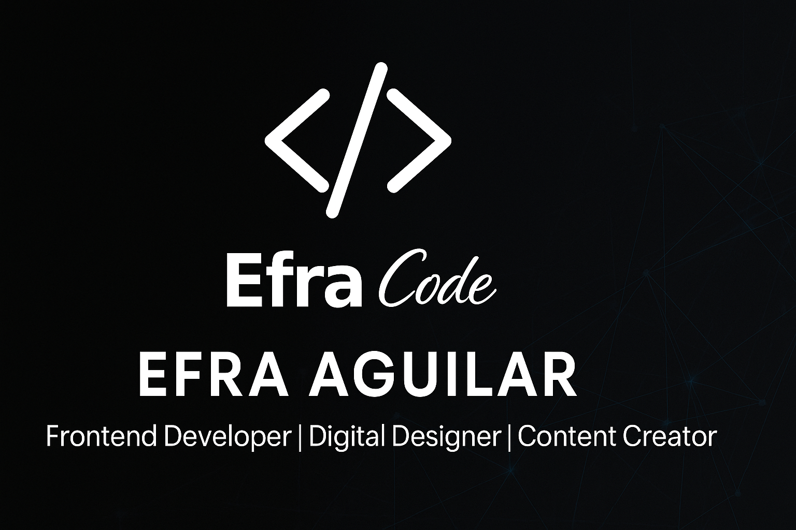

  

<h1 align="center">👋 Hi, I'm <b>Efrain Aguilar</b></h1>
<h3 align="center">Front-End Developer | Digital Designer | EfraCode 🎨💻</h3>

 
 <picture></picture> About me

<picture> </picture>

	

 

- :technologist: A passionate Self-taught Front-end development.
- :computer: Currently learning Web Development by Self.
- :boom: Personal website [link](https://efrainaguilar.com)
- :student: I’m currently open to a new job opportunity.

  

<h2 align="center">🎥 Educational Series: EfraCode Web Fundamentals</h2>

Explora mis videos educativos donde explico temas como la Web, Internet y la evolución tecnológica.

<table align="center">
  <tr>
    <td align="center">
      
       
      <b>La historia de la Web</b>
    </td>
    <td align="center">
      
       
      <b>Diferencia entre Internet y la Web</b>
    </td>
    <td align="center">
  
   
  <b>Cómo funciona una página web</b>
</td>

	  
  </tr>
</table>

  
💡 **I love building interactive and responsive websites using modern web technologies.**

## <b> Skills</b>
 

- **Front-End Development**:
  
  
  
  
  
  
  
  
  

 

- **Back-End & Tools**:

  
  
  
  
  

 

-----

## <b> Let's Connect..!</b>
 

<ul>

<li>

</li>

 

<li>

</li>

 

<li>

</li>

 

<li>

</li>

 

<li>
  
</li>

</ul>

Credit: Efrain Aguilar

🕓 <i>Last updated on October 10, 2025</i>

<!--
**Efrain-start/Efrain-start** is a ✨ _special_ ✨ repository because its `README.md` (this file) appears on your GitHub profile.

Here are some ideas to get you started:

- 🔭 I’m currently working on ...
- 🌱 I’m currently learning ...
- 👯 I’m looking to collaborate on ...
- 🤔 I’m looking for help with ...
- 💬 Ask me about ...
- 📫 How to reach me: ...
- 😄 Pronouns: ...
- ⚡ Fun fact: ...
-->
